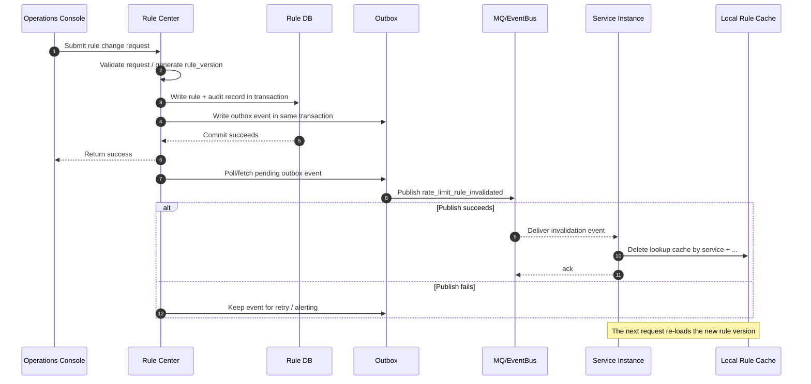
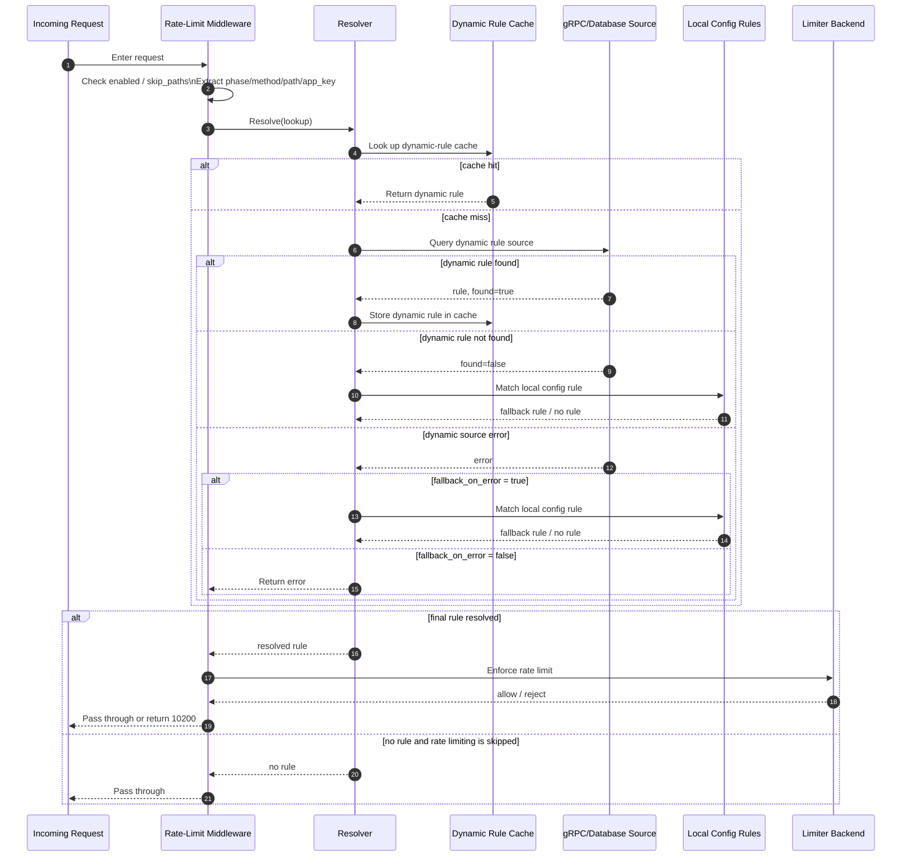
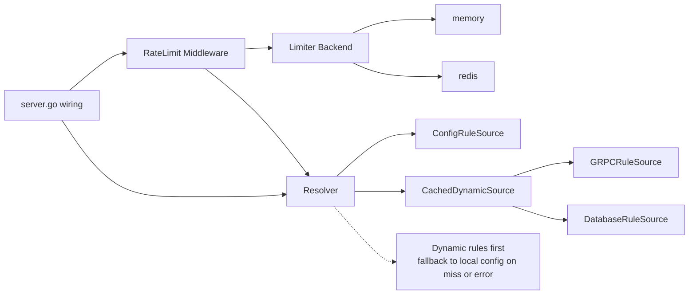

<!-- ncgo:managed -->
# Dynamic Rate-Limit Design for the Hertz Template

Audience: `ncgo` maintainers and AI agents that read or modify the
`internal/assets/_data/hertz/` template tree. This document describes the
goals, constraints, architecture, and implementation boundaries of dynamic
rate limiting in the Hertz template family.

For the broader template design, see [`design-doc.en.md`](./design-doc.en.md).

For the Chinese version of this topic, see
[`rate-limit-dynamic-design.zh-CN.md`](./rate-limit-dynamic-design.zh-CN.md).

## 1. Background

Today the Hertz template primarily relies on static `rate_limit` settings under
`conf/<env>/conf.yaml`. That works for simple cases, but it falls short when:

- Operations platforms must publish rules dynamically.
- Limits must be scoped at the API level.
- Combined dimensions such as `ak + path` are required.
- Local config fallback must remain available when a remote rule source fails.

Because of that, the template needs a dynamic rate-limit model built around
"dynamic rule source + local cache + config fallback".

## 2. Goals and Non-Goals

### 2.1 Goals

- Support dynamic rule lookup from a **gRPC** service.
- Support rule lookup through a **database hook + repository/sqlc skeleton**.
- Cache dynamic rule lookup results in local process memory.
- Fall back to config-file rules when a dynamic lookup returns **not found**.
- Fall back to local rules on dynamic-source **errors** when configured to do so.
- Support API-level dimensions, with `ak_path` as the first-class priority.
- Support the `fixed_window` strategy while keeping `token_bucket` compatibility.
- Keep existing `memory` / `redis` backends for rate-limit state storage.

### 2.2 Non-Goals

- No built-in active push from a centralized rule center.
- No unified subscription bus for rules.
- No built-in business-private rule-table schema, and no built-in DSL, scripting, or cross-table rule-composition engine in the default template.
- No complex multi-dimensional priority engine in the template.
- No requirement that every project adopt a dynamic rule source; `config` must
  remain usable by itself.

### 2.3 Executive Summary

If only a few minutes are available, the following points capture the core of
the design:

- The overall model is **dynamic rule source + local rule cache + config fallback**.
- Rule resolution is **dynamic first**; misses fall back to local config, and errors fall back only when `fallback_on_error` allows it.
- Before a request is finally allowed or rejected, `fail_open` still decides how unrecoverable errors are handled.
- The dynamic cache stores **rule lookup results**, not enforcement counters; in multi-instance production, the counter backend is usually better placed in `redis`.
- A safer rollout order is: `config` → `resolver` → one dynamic source → cache → invalidation → rollout/rollback/outbox.
- The mainline of this document focuses on design and rollout guidance; code examples and testing material are organized in appendices.

## 3. Design Overview

Dynamic rate limiting is split into three layers:

1. **Rule source layer**: decides where rules come from; supports `config`,
   `grpc`, and `database`.
2. **Rule cache layer**: caches dynamic rule lookup results so every request does
   not hit a remote service or database.
3. **Enforcement layer**: applies rate limiting based on the final resolved rule.

In this model:

- The `grpc` source is built into the template.
- The `database` source ships with a default template skeleton, including the
  hook/interface, repository, sqlc queries, and a default rule table.
- `config` remains the final fallback source.

### 3.1 Glossary

To keep the rest of the document consistent, the following terms should be used
with one shared meaning:

| Term | Meaning |
| --- | --- |
| dynamic source | A runtime rule source, usually `grpc` or `database`, used to look up rules dynamically |
| local config / config source | The local rule source from `conf/<env>/conf.yaml`, serving as the final fallback |
| lookup | One rule-query input, usually containing `service`, `phase`, `method`, `path`, and optional `app_key` |
| resolved rule | The final rule selected by the resolver and handed to the limiter for enforcement |
| `default_rule` | The phase-level default fallback rule used when no more specific rule matches |
| fallback | The act of continuing to local config when the dynamic path misses or is allowed to fall back |
| `fallback_on_error` | A resolver-layer switch that decides whether local config is still tried after dynamic-source failure |
| `fail_open` | A middleware / enforcement-layer switch that decides whether the request passes when an unrecovered error remains |
| invalidation | Cache-clearing behavior triggered by rule changes, often propagated by MQ, an event bus, or a stream |
| negative cache | A short-lived cache entry for explicit “not found” results to avoid repeated upstream lookups |
| `rule_version` | A rule-version marker used for auditability, rollout, rollback, and hit-path observability |

### 3.2 Recommended Reading Path

To keep the mainline easier to follow, it is best to read this document in the
following order:

- `1 ~ 14`: core design, runtime flow, cache, invalidation, and code-organization boundaries
- `15 ~ 18`: implementation and rollout guidance, including delivery order, defaults, risks, and conclusion
- `Appendix A / Appendix B`: integration examples and testing checklists as needed

## 4. Rule Priority and Resolution Order

### 4.1 `source.type = config`

Use config-file rules directly.

### 4.2 `source.type = grpc`

Resolve in this order:

1. Check the local rule cache first.
2. On cache miss, issue a gRPC lookup.
3. If gRPC **finds** a rule, use the remote rule directly.
4. If gRPC returns **not found**, fall back to config-file rules.
5. If gRPC returns an **error**, decide whether to fall back based on
   `fallback_on_error`.

### 4.3 `source.type = database`

Resolve in this order:

1. Check the local rule cache first.
2. On cache miss, call the database hook.
3. If the hook **finds** a rule, use the database rule directly.
4. If the hook returns **not found**, fall back to config-file rules.
5. If the hook returns an **error**, decide whether to fall back based on
   `fallback_on_error`.

## 5. Rule Model

### 5.1 Supported Strategies

- `fixed_window`: a good fit for common operational rules like
  "at most N requests within a fixed time window".
- `token_bucket`: retained for compatibility with the current template and for
  traffic-shaping scenarios.

### 5.2 Supported Dimensions

Recommended `key_by` values:

- `ip`
- `ak`
- `user_uuid`
- `ak_user_uuid`
- `path`
- `method_path`
- `ak_path`
- `ak_method_path`

This design prioritizes `ak_path` because it directly covers the core use case:
"limit a specific API for a specific app key".

## 6. Configuration Design

Recommended additions under `rate_limit`:

- `source.type`: `config` / `grpc` / `database`
- `source.cache_ttl_seconds`: TTL for dynamic-rule cache entries
- `source.fallback_on_error`: whether local config should be used when the
  dynamic source errors
- `grpc.target`: rule-center gRPC address
- `grpc.timeout_milliseconds`: gRPC lookup timeout
- `grpc.auth_header` / `grpc.auth_token`: optional auth parameters
- `grpc.service_name`: current service name
- `database.query_timeout_milliseconds`: database-hook lookup timeout

### 6.1 Recommended Configuration Reference Table

To keep implementation and operations aligned, it helps to treat the following
fields as one coherent set:

| Config field | Recommended / common values | Purpose | Risk note |
| --- | --- | --- | --- |
| `source.type` | `grpc` / `database` / `config` | Decides where dynamic rules are looked up | If it is accidentally set to `config`, the whole dynamic path is bypassed |
| `source.cache_ttl_seconds` | `30 ~ 120`, with `60` as a practical default | Controls how long dynamic lookup results stay cached in-process | Too short increases remote load; too long slows rule-change convergence |
| `source.fallback_on_error` | `true` | Decides whether local config is still used after dynamic-source failure | If set to `false`, upstream failures are more likely to surface directly into request handling |
| `backend` | `memory` for monolith/dev, usually `redis` for multi-instance production | Chooses where enforcement counters are stored | In multi-replica deployments, `memory` splits quota across instances |
| `fail_open` | Usually `false`; availability-sensitive APIs may evaluate `true` | Decides whether requests pass when resolver or limiter-backend errors remain unrecovered | `true` is more available but looser; `false` is safer but more failure-sensitive |
| `skip_paths` | e.g. `/healthz`, `/readyz` | Skips rate limiting for health or internal endpoints | If configured too broadly, protected endpoints may bypass limiting |
| `grpc.timeout_milliseconds` | `100 ~ 500` | Timeout for gRPC rule lookup | Too large increases tail latency; too small turns normal jitter into lookup failures |
| `database.query_timeout_milliseconds` | `100 ~ 500` | Timeout for database-hook lookup | Too large increases request blocking; too small can make DB-backed rules effectively unusable |
| `grpc.service_name` | A stable service name | Works as rule namespace and part of cache-key identity | If it drifts, cross-service rule isolation breaks |
| `pre_auth.default_rule` / `post_auth.default_rule` | Explicitly define them | Serve as the final local fallback rule | If they are left implicit, miss/error paths may become unexpectedly too strict or too loose |

If only five fields should stay top-of-mind, prioritize:

- `source.type`
- `source.cache_ttl_seconds`
- `source.fallback_on_error`
- `backend`
- `fail_open`

The phase config should still keep `pre_auth` and `post_auth`, but it should be
expanded to contain:

- `enabled`
- `default_rule`
- `rules`

Where:

- `default_rule` is the phase-level fallback rule.
- `rules` is the set of local fine-grained matching rules.

`phase` should be treated as an **execution-stage label**, not the primary
business identity dimension of the rule itself. Recommended convention:

- `pre_auth`: used for anonymous, invalid, or not-yet-authenticated requests,
  such as missing `app_key`, invalid signatures, or missing auth headers. Rule
  lookup should usually depend on stable fields such as `method` and `path`,
  while enforcement may still use `client_ip` as a `key_by` value source.
- `post_auth`: used for finer-grained limits after authentication succeeds. At
  that point, rule lookup can additionally use `app_key`, `method`, and `path`,
  while enforcement may use fields such as `user_uuid` as `key_by` inputs.

If a project only enforces rate limiting in one stage, `phase` can simply stay
fixed to that value.

Recommended local config rules should stay as close as possible to the same
matcher model used by dynamic sources. Recommended fields are:

- `app_key`
- `method`
- `match_kind`
- `path` (`match_kind=exact`)
- `path_pattern` (`match_kind=prefix/glob/regex`)
- `priority`

`path_prefix` may still be kept as a compatibility alias and interpreted as
`match_kind=prefix`.

Recommended local rule precedence:

1. `priority DESC`
2. app-specific rules before fallback rules
3. method-specific rules before method-agnostic rules
4. `match_kind` rank:
   - `exact`
   - `prefix`
   - `glob`
   - `regex`
5. higher path specificity
6. `default_rule`

## 7. gRPC Rule Source

The template includes a built-in gRPC rule-source implementation. Its job is to:

- Build query parameters from request context.
- Issue a gRPC lookup with timeout control.
- Map the response into a unified rule shape.
- Distinguish among **found**, **not found**, and **error**.

The minimum recommended query fields are:

- `service`
- `phase`
- `method`
- `path`

Optionally add:

- `app_key`

`phase` separates the `pre_auth` and `post_auth` rule sets. For anonymous or
invalid requests, the lookup should still be able to find a fallback rule using
`phase + method + path` even when `app_key` is absent.

`user_uuid` and `client_ip` are usually better treated as runtime inputs for
`key_by`, rather than default gRPC lookup dimensions. Putting them into rule
lookup by default makes the rule space too granular and hurts cache hit rate.

`request_id` should not participate in rule lookup or cache keys. It is useful
for logs and tracing, not for rule matching.

The gRPC response must be able to clearly express:

- **Found rule**: use the remote rule directly.
- **Not found**: fall back to config-file rules.
- **Lookup error**: decide whether to fall back based on `fallback_on_error`.

The gRPC expression layer should also stay as close as possible to the same
matcher model used by `config / database`.

### 7.2 Rule-Center (`source.type = rule_center`)

`rule_center` is a concrete instantiation of the gRPC rule source, designed for
multi-service environments where rate-limit rules are managed centrally in a
standalone Kitex gRPC service rather than per-service.

#### How It Differs from `source.type = grpc`

| Dimension | `grpc` (generic) | `rule_center` (concrete) |
|---|---|---|
| Proto contract | Project-defined | ncgo-generated (`ratelimit.v1.RuleService`) |
| Server side | Project implements | ncgo-generated Kitex scaffold (`--preset rule-center`) |
| Client file | Project writes | ncgo-generated (`rule_center_client.go`) |
| Config block | `grpc.target` | `rule_center.address` / `rule_center.query_timeout_milliseconds` |
| CLI entry | Manual setup | `ncgo new --rule-center-addr` / `ncgo add rule-center` |

Under the hood, `rule_center` uses the same `GRPCClient` interface and flows
through the same resolver cache layer as the generic `grpc` source.

#### Configuration

```yaml
rate_limit:
  enabled: true
  source:
    type: rule_center
    cache_ttl_seconds: 60
    fallback_on_error: true
  rule_center:
    address: "rule-center:8888"
    query_timeout_milliseconds: 200
  backend: redis
```

#### Query Flow (Identical to gRPC Source)

1. Check local memory cache (valid within `cache_ttl_seconds`).
2. Cache hit → return cached rule.
3. Cache miss → gRPC `GetRule` to rule-center, write result to cache.
4. gRPC failure + `fallback_on_error: true` → use stale cached rule.
5. gRPC failure + no cache → pass or reject based on `fail_open`.

#### CLI Commands

```bash
# Create the rule-center Kitex service
ncgo new rule-center --module github.com/acme/rule-center \
  --kind kitex --db postgres --preset rule-center

# Create a Hertz service wired to the rule-center
ncgo new user-api --module github.com/acme/user-api \
  --kind hertz --db postgres --rule-center-addr rule-center:8888

# Add rule-center support to an existing Hertz service
ncgo add rule-center --root ./user-api --addr rule-center:8888
```

#### Generated Files

When `--rule-center-addr` is provided, ncgo generates:

- `internal/pkg/middleware/rule_center_client.go` — gRPC client implementing
  `ratelimit.GRPCClient`, connected to the rule-center address
- `conf/dev/conf.yaml` — `source.type` set to `rule_center` with the
  `rule_center` config block populated

The `rule_center_client.go` template is marked optional in the embedded asset
tree (`internal/assets/_data/hertz/optional/rule_center_client.go`). It uses
`{{.GoModule}}` placeholders that are rendered at generation time.

### 7.3 Recommended gRPC Request/Response Fields

`GetRuleRequest` should usually include at least:

- `service`
- `phase`
- `method`
- `path`

`service` should be treated as the **rule namespace / service boundary marker**.
Its main purposes are:

- identifying which service is asking for the rule
- preventing rule collisions when different services share the same
  `phase + method + path`
- keeping cache keys, invalidation, audit logs, and observability scoped by
  service

Its responsibility is different from `app_key`:

- `service`: which **service** is performing rule lookup
- `app_key`: which **caller inside that service** may have an override rule

For Hertz monolith mode, `service` can usually stay as a stable fixed value
(such as the service name), but it is still recommended to keep the field in the
protocol.

Optionally add:

- `app_key`

The rule payload inside `GetRuleResponse` should preferably include:

- `enabled`
- `key_by`
- `strategy`
- `window_seconds`
- `max_requests`
- `requests_per_second`
- `burst`
- `client_ttl_seconds`
- `match_kind`
- `path`
- `path_pattern`
- `priority`

Where:

- request-side `path` is the actual incoming request path used for lookup
- response-side `match_kind / path / path_pattern / priority` describe the
  matched rule itself
- even if the current Hertz client only consumes the normalized
  `RateLimitRuleConfig`, keeping these fields in protobuf is still valuable for
  observability, auditability, and debugging

## 8. Database Hook

Rule-table schemas can vary across projects, but for Hertz monolith mode the
template should still generate a **working database skeleton** instead of only a
hook definition. That lets a new project run the full path first, then replace
table shape and query details incrementally.

The current template direction is to generate:

- `internal/db/schema/000002_rate_limit_rules.sql`
- `internal/db/query/rate_limit_rule.sql`
- `internal/db/migrations/000002_rate_limit_rules.sql`
- `internal/db/seed/rate_limit_rules.example.sql`
- `internal/repository/rate_limit_rule.go`
- `internal/repository/rate_limit_rule_test.go`
- database wiring in `internal/base/server/server.go`

Recommended database lookup fields should stay aligned with gRPC:

- `phase`
- `method`
- `path`

Optionally add:

- `app_key`

`user_uuid` and `client_ip` should usually stay out of the database lookup
criteria and instead be used during enforcement as `key_by` value sources.

In this generated skeleton:

- schema / migration define a default `rate_limit_rules` table
- a seed example provides starter rows for anonymous fallback and app-specific rules
- sqlc queries implement `exact / prefix / glob / regex` matching plus `priority` ordering
- the repository wraps sqlc-generated code and maps rows into
  `RateLimitRuleConfig`
- `server.go` wires the database source through `internal/base/data` and
  `samber/do`

The business project can still adjust:

- table shape and indexes
- sqlc / ORM / DAO query logic
- row-to-rule mapping details

The database hook must also distinguish:

- Found rule
- Not found
- Query error

### 8.1 Default `rate_limit_rules` Table Fields

The generated template starts with a rule table that already supports
**`exact / prefix / glob / regex` matching**, which is a good V1 baseline.

| Field | Meaning | Default role |
| --- | --- | --- |
| `phase` | rate-limit execution stage | separates `pre_auth` / `post_auth` |
| `method` | HTTP method | participates in rule lookup |
| `match_kind` | matching mode | supports `exact` / `prefix` / `glob` / `regex` |
| `path` | exact request path | used when `match_kind=exact` |
| `path_pattern` | pattern path | used when `match_kind=prefix/glob/regex` |
| `app_key` | optional app dimension | non-null means app-specific override; null means fallback |
| `priority` | rule priority | higher value wins among matching pattern rules |
| `enabled` | whether the rule is enabled | turns the dynamic rule on/off |
| `key_by` | runtime enforcement dimensions | e.g. `ip`, `ak_path`, `ak_user_uuid` |
| `strategy` | rate-limit strategy | default template supports `fixed_window` / `token_bucket` |
| `window_seconds` | fixed-window duration | mainly used by `fixed_window` |
| `max_requests` | max requests per window | mainly used by `fixed_window` |
| `requests_per_second` | steady refill rate | mainly used by `token_bucket` |
| `burst` | burst capacity | mainly used by `token_bucket` |
| `client_ttl_seconds` | suggested local limiter-state TTL | controls local state lifetime |

### 8.2 Example Seed Data

The template also generates:

- `internal/db/seed/rate_limit_rules.example.sql`

This file is **not executed automatically**. It exists only as starter data.
Recommended starter rows include:

- an anonymous / invalid-request fallback rule using
  `pre_auth + exact + app_key=NULL`
- an app-specific post-auth exact rule using
  `post_auth + exact + app_key=<value>`
- sample pattern rows using `prefix / glob / regex + priority`

That gives generated projects something concrete to copy for local development
without hard-wiring sample data into formal migrations.

### 8.3 Implemented Matching Model and Evolution Boundary

The current template already implements:

- `exact` matching
- `prefix` matching
- `glob` matching
- `regex` matching
- `priority` ordering

`regex` is now included as a supplementary capability in the default template,
but it should still be used carefully because it materially increases SQL,
indexing, and rule-maintenance complexity.

#### Path-Matching Tiers

In the current template, path matching is split into mutually exclusive modes:

- `exact`: exact path such as `/v1/orders`
- `prefix`: path prefix such as `/v1/orders/`
- `glob`: wildcard such as `/v1/orders/*`
- `regex`: regular expression such as `^/v1/orders/[0-9]+$`

The template already models richer matching through explicit fields such as:

- `match_kind`
- `path_pattern`
- `priority`

Avoid adding extra boolean switches that overlap with `path` and
`path_pattern`, because that quickly makes query semantics hard to maintain.

#### Recommended Rule Selection Order

The repository currently implements **exact first, pattern second** using this
order:

1. `app_key + exact`
2. `fallback + exact`
3. `app_key + pattern`
4. `fallback + pattern`

For pattern rules, the current template uses this stable ordering:

1. `priority DESC`
2. `match_kind` rank:
   - `prefix`
   - `glob`
   - `regex`
3. `specificity score DESC`
   - `prefix`: longer `path_pattern` wins
   - `glob`: more literal characters after removing `*` wins
   - `regex`: more literal-ish characters after stripping most regex metacharacters wins
4. `CHAR_LENGTH(path_pattern) DESC`
5. `updated_at DESC` or `id DESC` as the final stable tie-breaker

#### Repository / sqlc Guidance

The template repository already splits internal lookup into two stages:

- `FindExactRule(...)`
- `FindPatternRule(...)`

The repository should continue to own exact-first, pattern-second,
priority-aware selection instead of leaking that complexity into middleware or
the resolver. The public surface may still stay as a unified `FindRule(...)`.

#### Suggested Migration Path

If a project still needs to go further, the recommended rollout is:

- **Current default template**: `exact + prefix + glob + regex + priority + matcher rank + specificity score`
- **V1.1**: add regex flags, case-sensitivity policy, or more advanced rule-composition semantics only if really needed
- **V2**: if rule volume keeps growing, consider splitting exact and pattern
  rules into separate tables or moving toward a dedicated rule service

#### Recommended `regex` Usage Boundary

Even though the template now supports `regex`, the practical recommendation is
still:

- prefer `exact` whenever possible
- prefer `prefix` / `glob` before reaching for `regex`
- use `regex` for path families that are truly awkward to model with simpler matchers
- keep hot paths covered by exact / prefix rules where possible, so not every
  request falls through to regex evaluation

The default template now explicitly ranks matcher classes as
`prefix > glob > regex`, so the more predictable and easier-to-maintain rule
types win before the more expensive and less transparent ones.

In other words, `regex` should be treated as a gap-filling capability, not the
main matching strategy.

## 9. Cache Design

The cache stores **dynamic rule lookup results**, not enforcement counters. Those
two responsibilities must stay separate.

Recommended cache key fields:

- `service`
- `phase`
- `method`
- `path`

Optionally add:

- `app_key`

If phase one only prioritizes `ak + path`, the cache key can still be modeled as
`service + phase + method + path + app_key`; for anonymous or invalid requests
without an `app_key`, it naturally degrades to
`service + phase + method + path`.

It is recommended to keep `service` explicitly in the cache key even for a
monolith where it may currently be a fixed value. That avoids changing key
semantics later when services split, a shared rule center is introduced, or
invalidation/audit tooling starts operating by service namespace.

### 9.1 Recommended Cache-Key Shape

Prefer a **field-name-explicit and readable** cache-key shape instead of relying
only on positional concatenation. For example:

- request with `app_key`:
  - `rl:lookup:svc=order-api:phase=post_auth:m=GET:path=/v1/orders:app=demo-app`
- anonymous / invalid request without `app_key`:
  - `rl:lookup:svc=order-api:phase=pre_auth:m=POST:path=/v1/orders:app=_`

Implementation notes:

- normalize `service / phase / method` consistently before building the key
- normalize and escape `path` consistently when needed so separators do not
  create ambiguity
- when `app_key` is absent, use a fixed placeholder such as `_` instead of
  omitting the field, so the key shape stays stable
- if version, environment, or tenant dimensions are added later, prefer
  appending more explicit fields such as `:env=prod`

Recommended cached content:

- Matched rules
- Empty results (negative cache)
- Optional metadata (source, version)

Recommended defaults:

- `cache_ttl_seconds = 60`
- Support concurrent miss coalescing
- Support negative caching

## 10. Cache Invalidation and Rule-Change Propagation

The rule cache should not rely on a single mechanism only. The recommended model
is **active invalidation + TTL fallback**.

### 10.1 Behavior with TTL Only

If the system only uses TTL caching, rule updates and deletions take effect like
this:

- **Rule update**: old cached data stays active until the TTL expires; the next
  request reloads the new rule.
- **Rule deletion**: old cached data also stays active until expiry; once it
  expires, a miss falls back to config-file rules.

This mode is the simplest to implement, but rule changes are not immediate.

### 10.2 Recommended Mode: Active Invalidation + TTL Fallback

When a rule is updated or deleted, the recommended behavior is to emit a
"cache invalidation" event. Service instances that receive it delete the local
cache entry. If some instance misses the event, TTL still repairs stale data.

Benefits of this model:

- Rule changes usually take effect quickly.
- Notification failures do not create permanently stale data.
- It balances timeliness and operational robustness.

### 10.2.1 Recommended Invalidation-Event Payload

If invalidation is propagated through MQ, an event bus, or a gRPC stream, the
event payload should also explicitly carry the same namespace fields used by the
cache key. A practical **JSON payload** example is:

```json
{
  "event_type": "rate_limit_rule_invalidated",
  "invalidate_scope": "precise",
  "service": "order-api",
  "phase": "post_auth",
  "method": "GET",
  "path": "/v1/orders",
  "app_key": "demo-app",
  "emitted_at": "2026-05-07T12:00:00Z"
}
```

Recommended meanings:

- `event_type`: event category so multiple event types can share one bus
- `invalidate_scope`: preferably support `precise` / `phase_prefix` / `full`
- `service`: the top-level rule namespace; it should match the `service` field
  used in cache keys
- `phase / method / path / app_key`: used to delete one precise lookup-cache entry
- `emitted_at`: helps with auditing and debugging

For anonymous / invalid requests without an `app_key`, it is recommended to use
the same fixed placeholder semantics as the cache key, for example:

```json
{
  "event_type": "rate_limit_rule_invalidated",
  "invalidate_scope": "precise",
  "service": "order-api",
  "phase": "pre_auth",
  "method": "POST",
  "path": "/v1/orders",
  "app_key": "_"
}
```

For broader invalidation by `service + phase`, a shorter payload can be used,
for example:

```json
{
  "event_type": "rate_limit_rule_invalidated",
  "invalidate_scope": "phase_prefix",
  "service": "order-api",
  "phase": "post_auth"
}
```

### 10.2.2 Operations-Oriented Rule-Change Workflow

For real operations consoles / control-plane use cases, it is best to treat
“**write the rule**” and “**emit the invalidation event**” as parts of the same
change workflow rather than two unrelated actions.

A safer recommended flow is:

1. validate the change request (field validity, rule conflicts, rollout scope)
2. generate a new `rule_version` or increment a monotonic version
3. write the rule change and audit record inside a DB transaction
4. write an outbox event in the same transaction if the outbox pattern is used
5. publish the invalidation event asynchronously after commit succeeds
6. let service instances consume the invalidation event and clear local cache

Recommended principles:

- **do not emit invalidation before the DB write**: consumers may clear cache and then reload stale data
- **do not write DB only without emitting invalidation**: then convergence depends entirely on TTL and becomes slower
- **DB write succeeded but invalidation publish failed** is the most important failure mode; prefer outbox / retry handling over manual repair

#### Recommended `rule_version` Semantics

Every rule change should ideally produce auditable version metadata, for example:

- a monotonic integer version
- a logical timestamp version
- a readable version like `v20260507_120000`

Typical uses of `rule_version` include:

- confirming in operations tooling which rule version is currently active
- recording the matched rule version in service logs for debugging
- deciding whether cache should be refreshed in polling-based modes
- identifying rollout / rollback batches

#### Rollout Guidance

If the operations platform needs a safer rollout path, prefer small-step rollout:

1. enable rules first on low-risk services or phases
2. observe hit rate, 429 ratio, error rate, and cache-miss volume
3. then expand to more endpoints or callers

Once `service` is already part of the namespace, rollout can usually be scoped by:

- `service`
- `phase`
- `app_key`
- a clearly bounded set of API paths

#### Rollback Guidance

It is better to model rollback as a **version switch** instead of ad-hoc manual
value edits. A more reliable pattern is:

- keep the previous rule snapshot
- on rollback, promote the target older version back to current
- emit a fresh `rule_version` and invalidation event for that rollback action

That keeps logs, audit trails, and cache invalidation consistent, and avoids the
ambiguity of “the DB value changed, but was it a rollback or a new edit?”.

### 10.2.3 Rule-Change Sequence Diagram

The Mermaid sequence diagram below turns the previous workflow into a single
visual path that is useful during design reviews and implementation alignment:



### 10.3 Update and Delete Scenarios

#### Updating a Rule

For example, an `ak + path` rule changes from "100 requests per 60 seconds" to
"20 requests per 60 seconds":

- **TTL mode**: the old rule remains active until cache expiry.
- **Active invalidation mode**: the cache entry is deleted and the next request
  reloads the new rule.

#### Deleting a Rule

For example, deleting a dedicated `ak + path` rule:

- **TTL mode**: the old cache remains until expiry, then a miss falls back to
  config rules.
- **Active invalidation mode**: the cache entry is deleted immediately and the
  next request falls back to config rules after re-querying.

For explicit remote misses or deleted rules, a short-lived negative cache entry
is recommended to avoid hammering the dynamic source under high concurrency.

### 10.4 Recommended Propagation for gRPC and Database

#### gRPC Placement

Prefer one of the following:

- **gRPC stream invalidation events**: instances subscribe to a rule-change
  stream and delete cache entries precisely.
- **MQ / event-bus broadcast**: the rule center broadcasts invalidation events
  via Kafka, Redis Pub/Sub, NATS, or similar infrastructure.

#### Database Placement

Databases typically do not push rule-change notifications directly to business
processes. Recommended options:

- **TTL only**: simplest, but less real time.
- **Emit invalidation events after DB writes**: when the operations platform
  updates the database, it also broadcasts invalidation messages.
- **Poll version / updated_at**: services periodically detect rule-version
  changes and clear affected cache entries.

### 10.5 Recommended Invalidation Granularity

Invalidation events should support at least:

- **Precise invalidation**: remove one cache entry by
  `service + phase + method + path + app_key`.
- **Prefix invalidation**: clear a group by `service + phase`.
- **Full flush**: clear the entire rule cache for emergency handling.

### 10.6 Recommended Rollout Path

Recommended phased rollout:

- **V1**: start with TTL cache only; changes take effect on expiry.
- **V2**: add active invalidation so updates/deletions converge faster.
- **Long-term**: active invalidation speeds convergence; TTL guarantees
  eventual consistency.

From an operations-process point of view, once rules become part of the online
control plane it is worth planning for:

- `rule_version`
- audit logs
- outbox / retry delivery
- gradual rollout
- one-click rollback

Not all of these need to be scaffolded in the very first template version, but
the design should leave room for them.

## 11. Enforcement Design

The rate-limit state store should continue using the existing backends:

- `memory`
- `redis`

Notes:

- Rules may be cached locally.
- In multi-instance deployments, counters usually belong in Redis; otherwise the
  quota is split across replicas.

Recommended `fixed_window` implementation:

- `memory`: track window start time and per-window count.
- `redis`: use a Lua script or equivalent atomic operations for counter + TTL.

`token_bucket` should remain available for compatibility with the current
template behavior.

## 12. Middleware Execution Flow

For each request entering the rate-limit middleware, the recommended flow is:

1. Check the global and phase-level enable flags.
2. Check whether the request hits `skip_paths`.
3. Extract request context: `app_key`, `method`, `path`, `user_uuid`, `ip`.
4. Resolve rules using lookup dimensions such as `phase`, `method`, `path`, and
   optional `app_key`, while keeping `user_uuid` and `ip` available for later
   `key_by` resolution.
5. If a dynamic rule is found, use it.
6. If no dynamic rule is found, fall back to local config rules.
7. If the dynamic source errors, decide using `fallback_on_error` and
   `fail_open`.
8. Enforce rate limiting using the final rule.
9. Return the result: pass through or `10200 rate_limited`.

### 12.1 Request-Time Rule-Resolution Sequence Diagram

The Mermaid sequence diagram below turns the request-time resolution path into a
single visual flow that pairs with the earlier rule-change workflow diagram:



### 12.2 Request-Side Exception Policy Matrix

At the boundary level, it is useful to think of these two switches separately:

- `fallback_on_error`: a **resolver-layer** switch that decides whether local config should still be tried after the dynamic rule source fails
- `fail_open`: a **middleware / enforcement-layer** switch that decides whether the request should pass when an unrecoverable error still remains

Recommended decision matrix:

| Scenario | `fallback_on_error` | `fail_open` | Final behavior | Notes |
| --- | --- | --- | --- | --- |
| Dynamic rule found | any | any | Enforce using the dynamic rule | Dynamic rules have highest priority |
| Dynamic rule not found | any | any | Fall back to a local matched rule or `phase.default_rule` | Normal fallback path |
| Dynamic source error | `true` | any | Fall back to a local matched rule or `phase.default_rule` | Availability-first behavior |
| Dynamic source error | `false` | `true` | Skip rate limiting for this request and pass through | Suitable for more availability-sensitive APIs |
| Dynamic source error | `false` | `false` | Return service-unavailable / dependency-error style failure | Suitable for more safety-sensitive APIs |
| Final rule already resolved, but limiter backend errors | any | `true` | Pass the request through | Backend-side fail-open |
| Final rule already resolved, but limiter backend errors | any | `false` | Return service-unavailable / dependency-error style failure | Backend-side fail-close |
| Local fallback / `default_rule` effectively disables rate limiting | any | any | Do not enforce; pass through | For example, rule `enabled=false` |

In practice, one sentence is enough to remember the split:

- `fallback_on_error` decides "**should the system keep looking for a rule after the dynamic source fails?**"
- `fail_open` decides "**if an error still remains, should the request pass or fail?**"

## 13. Template Changes

This design mainly affects the following generated template outputs:

- `conf/dev/conf.yaml`
- `internal/base/conf/conf.go`
- `internal/base/server/server.go`
- `internal/db/schema/000002_rate_limit_rules.sql`
- `internal/db/query/rate_limit_rule.sql`
- `internal/db/migrations/000002_rate_limit_rules.sql`
- `internal/db/seed/rate_limit_rules.example.sql`
- `internal/repository/rate_limit_rule.go`
- `internal/repository/rate_limit_rule_test.go`
- `internal/pkg/middleware/rate_limit.go`
- `internal/pkg/middleware/rate_limit_test.go`

The following docs should also be kept in sync:

- `design-doc.zh-CN.md`
- `design-doc.en.md`

## 14. Code-Organization Guidance

To avoid putting middleware orchestration, rule resolution, gRPC calls,
database hooks, and cache logic all into `internal/pkg/middleware/rate_limit.go`,
the generated project should add a dedicated rule-resolution package.

### 14.1 Recommended Directory

Add:

- `internal/pkg/ratelimit/`

This package owns the dynamic rate-limit rule-resolution domain.

### 14.2 Recommended Responsibility Split

Recommended file split:

- `internal/pkg/ratelimit/types.go`
  - shared models such as `lookup`, `resolvedRule`, and `resolveResult`
- `internal/pkg/ratelimit/source.go`
  - unified rule-source interfaces and abstractions
- `internal/pkg/ratelimit/cache.go`
  - shared cache layer, for example `CachedRuleSource`
- `internal/pkg/ratelimit/config_source.go`
  - local config matching and fallback logic
- `internal/pkg/ratelimit/grpc_source.go`
  - gRPC dynamic rule lookup
- `internal/pkg/ratelimit/database_source.go`
  - database hook wrapper and entry point
- `internal/pkg/ratelimit/resolver.go`
  - unified resolution entry for "dynamic first + config fallback"

### 14.3 Cache Placement Guidance

The gRPC and database cache layer should not be embedded separately inside each
implementation. It should live as a shared decorator in
`internal/pkg/ratelimit/cache.go`.

Why:

- What is cached is the **rule lookup result**, not a concrete gRPC client or
  database connection.
- gRPC and database rule sources need the same caching semantics.
- A shared layer centralizes TTL, negative cache, and concurrent miss merging.

Recommended relationships:

- `CachedRuleSource`
  - wraps `GRPCRuleSource`
  - or wraps `DatabaseRuleSource`
- `Resolver`
  - prefers the dynamic source
  - falls back to `ConfigRuleSource` on miss or error

#### 14.3.1 Component Relationship Diagram

The Mermaid diagram below is better for understanding the static dependency
structure between the main runtime pieces:



### 14.4 Boundary Between Middleware and Resolver

`internal/pkg/middleware/rate_limit.go` should only keep these responsibilities:

- Check whether rate limiting is enabled
- Check whether the request matches `skip_paths`
- Extract request context
- Call `ratelimit.Resolver` to get the final rule
- Run the concrete enforcement logic
- Map rejections to the response code

It should not directly own:

- gRPC query implementation
- database-hook implementation
- rule-cache implementation
- complex local rule matching logic

### 14.5 Server Assembly Location

Rule-resolution components should be initialized and assembled in
`internal/base/server/server.go`.

Recommended startup flow:

1. Read `cfg.RateLimit`.
2. Create the dynamic rule source according to `source.type`.
3. For database mode, build the repository from `internal/base/data`.
4. Wrap the dynamic source with the shared cache layer.
5. Create the local config rule source.
6. Assemble the unified `Resolver`.
7. Pass the `Resolver` into the rate-limit middleware.

This keeps the cache and source as **process-level singletons** rather than
creating them per request.

### 14.6 Placement Boundary for gRPC and Database

#### gRPC

Split it into two layers:

- **Connection or client construction**: may live in `internal/base/data` or
  startup assembly code.
- **Rule-query semantics**: should live in
  `internal/pkg/ratelimit/grpc_source.go`.

#### Database

Also split it into two layers:

- **Generated repository and DB access**: the template can place the sqlc-backed
  skeleton under `internal/repository`, `internal/db`, and `internal/base/data`.
- **Hook abstraction and invocation**: lives in
  `internal/pkg/ratelimit/database_source.go`.

### 14.7 Summary

Recommended organization:

- `internal/pkg/ratelimit/`: rule resolution, rule cache, source abstractions,
  resolver
- `internal/pkg/middleware/rate_limit.go`: middleware entry and orchestration
- `internal/base/server/server.go`: startup-time resolver assembly
- `internal/base/data`: low-level DB/client construction and shared infra deps
- business repository / data layer: concrete database-hook implementation,
  starting from the generated sqlc-backed skeleton

This organization lowers coupling and leaves room for additional rule sources or
future invalidation mechanisms.

## 15. Implementation and Rollout Guidance

### 15.1 Recommended Startup Strategy

Recommended integration path:

- **V1**: start with `config` + local fallback so the feature works end to end.
- **V1.1**: inject a real `grpc client` or `database hook` implementation.
- **V2**: add active invalidation based on the cache-invalidation section above.

If the project does not yet have a real gRPC or database rule source, it can
stay on `source.type=config` without losing the rest of the rate-limit feature.

### 15.2 Recommended Delivery Sequence

If the project wants to roll out this dynamic rate-limit capability in a safer
way, it is better to introduce it step by step instead of enabling every moving
part at once:

1. **Step 0: make local rules work first**
   - start with `source.type=config`
   - verify `pre_auth / post_auth`, `default_rule`, `key_by`, and `fixed_window`
     behavior first
2. **Step 1: standardize on the resolver entry point**
   - make middleware depend only on `Resolver`
   - stabilize the “dynamic first + local fallback” boundary before adding more infra
3. **Step 2: integrate only one dynamic source first**
   - choose either `grpc` or `database`
   - verify the three main paths: found / not found / error
4. **Step 3: then enable local dynamic-result caching**
   - configure `source.cache_ttl_seconds`
   - verify cache hit, negative cache, TTL expiry, and concurrent miss behavior
5. **Step 4: switch to the right enforcement backend for production**
   - `memory` is acceptable for monolith/dev
   - `redis` is usually the better production choice for multi-instance services
6. **Step 5: add active invalidation**
   - introduce invalidation events
   - stop relying on TTL alone for rule-change convergence
7. **Step 6: add operational hardening**
   - add `rule_version`
   - add gradual rollout / rollback support
   - add outbox / retry / audit logs for critical paths

Why this order is recommended:

- earlier steps focus on basic feature correctness
- later steps focus on production robustness and operations
- it avoids introducing message-delivery, cache-invalidation, and rollback complexity before the rule path itself is stable

## 16. Recommended Default Configuration

Recommended default configuration:

- `source.type = grpc`
- `source.cache_ttl_seconds = 60`
- `source.fallback_on_error = true`
- `strategy = fixed_window`
- `key_by = ["ak_path", "ip"]`

These defaults balance dynamic-rule capability, runtime stability, and local
fallback behavior.

## 17. Risks and Notes

- **Cache freshness**: with TTL-based caching, rule changes do not take effect
  instantly.
- **Multi-instance deployment**: production systems should usually store
  counters in Redis.
- **Path normalization**: prefer router template paths when available; fall back
  to raw request paths otherwise.

## 18. Conclusion

This design adopts:

- built-in gRPC rule-source support
- database rule-source extensibility through a hook
- config-file rules as the final fallback source
- local in-memory caching for dynamic rule results
- `fixed_window` support while retaining `token_bucket`
- continued use of `memory` / `redis` for enforcement state storage

The result balances dynamic-rule capability, template generality, runtime
stability, and compatibility with the existing Hertz template family.

## 19. Kitex Service Rate-Limit Enforcement

This chapter describes ncgo's rate-limit interception on the **Kitex RPC**
side. The Hertz (HTTP) design lives in the sections above; the Kitex side shares
the same rate-limit infrastructure (resolver / store / rule-center client) and
only differs in the middleware adaptation layer, where the two frameworks expose
different APIs.

### 19.1 Background and Positioning

Previously the Kitex template generated `internal/base/middleware/ratelimit.go`
as a pass-through placeholder (`RateLimit()` simply returned
`next(ctx, req, resp)`), with a comment noting that "Rate-limit enforcement for
Kitex services will be added in a follow-up." This cycle replaces it with a
real middleware.

Why Kitex-side interception matters:

1. **Self-protection / cascade prevention**: a slow downstream causes upstream
   goroutine pile-up and cascading failure. RPC-level rate limiting is the
   flood dam that sits in front of circuit breaking.
2. **Hertz is not the only caller**: service-to-service calls (Kitex→Kitex),
   cron jobs, and internal tools that dial RPC directly all bypass HTTP-edge
   rate limiting.
3. **Fan-out amplification**: one HTTP request can fan out into N RPC calls, and
   edge rate limiting cannot see the amplification factor.
4. **Multi-caller fairness**: per-caller limiting prevents a noisy neighbor from
   exhausting downstream capacity.
5. **Very low marginal cost**: the rule-center, resolver, store, caching, and
   fallback infrastructure already exists; the Kitex side only needs a
   middleware adaptation layer.

Positioning:

- **Shares** `internal/pkg/ratelimit` (resolver + store) and the
  `rule_center_client` with the Hertz side — **single source of truth**.
- The middleware layer is framework-specific: Hertz adapts `app.HandlerFunc`,
  Kitex adapts `endpoint.Middleware`.
- Generated projects default to **shadow observation mode** (counted but never
   rejected); operators switch to enforce manually after observation.

### 19.2 Dual-Track Interception Model

The Kitex side uses a **dual-track** defense. The two tracks operate
independently:

```
RPC request enters the Kitex server
  │
  ├─ [static track] server.WithLimit(MaxConnections/MaxQPS)   ← coarse global safety net
  │    conf: rate_limit.static.{max_qps,max_connections}        default 0 = not mounted
  │    over-limit → rejected by the Kitex framework layer
  │
  └─ [dynamic track] WithMiddleware chain:
       RequestID → AccessLog → Recovery
       → CallerAllowlist            ← caller identity is ready after this point
       → middleware.RateLimit(cfg.RateLimit)   ★ new
       → RequestTimeout
            │
            ├─ Lookup{Service, Method, AppKey, ClientIP, Phase: "post_auth"}
            ├─ shared resolver: dynamic source (rule_center/grpc/database)→ cache (TTL)
            │                     → on failure, fall back to local config rules per fallback_on_error
            ├─ shared store: memory (hot LRU)| redis (Lua script)
            └─ verdict:
                  allow                   → next(ctx, req, resp)
                  over-limit + mode=enforce → BizStatusError 10429 + metainfo retry-after
                  over-limit + mode=shadow  → count / log / metric, then pass  ← default
```

Track responsibilities:

| Track | Config entry | Role | Default state |
| --- | --- | --- | --- |
| Static | `rate_limit.static.{max_qps, max_connections}` | Coarse global connection/QPS safety net, rejected by the Kitex framework | `0` = not mounted |
| Dynamic | `rate_limit.mode` + `source.*` / `backend` | Fine-grained limiting by rule source + caller/method dimension | `mode = shadow` (counted, never rejected) |

### 19.3 Shared Infrastructure and Framework Boundary

To stop the Hertz and Kitex sides from each maintaining their own copy of the
resolver and store, this cycle extracts the relevant assets from
`hertz/layout.yaml` into framework-neutral shared snippets under
`internal/assets/_data/ratelimit/`:

| Shared snippet | Responsibility | Single source of truth? |
| --- | --- | --- |
| `resolver.yaml` / `resolver_test.yaml` | Rule resolution (dynamic-first + local fallback + cache) | Yes |
| `store.yaml` / `store_test.yaml` | Counter backend (memory / redis) | Yes |
| `rule_center_client.yaml` | rule-center gRPC client | Yes |

Hertz's `hertz/layout.yaml` is a single-file custom layout consumed by the `hz`
tool and cannot reference external files. Before writing
`template/layout.yaml`, ncgo expands directive comments such as
`# {{include: ratelimit/resolver}}` into the corresponding snippet content. The
`hz` tool consumes the already-assembled layout and never sees the directives.
Hertz golden tests guarantee the assembled output is **byte-for-byte identical**
to the pre-extraction output.

**Core principle**: resolver / store / rule-center client are a single source of
truth; only the middleware adaptation layer is framework-specific:

| Layer | Hertz | Kitex |
| --- | --- | --- |
| Middleware signature | `app.HandlerFunc` | `endpoint.Middleware` |
| Request context | `*app.RequestContext` | `rpcinfo.RPCInfo` + `context.Context` |
| Caller identity | header / meta | transmeta `x-caller-service` |
| Rejection semantics | HTTP `429` | BizStatusError `10429` + metainfo |
| Static safety net | none (no Hertz equivalent) | `server.WithLimit` |

Both sides share the same `RateLimitConfig` struct, but the defaults differ:
**Hertz `Mode` defaults to `enforce`** (preserving existing behavior); **Kitex
`Mode` defaults to `shadow`** (safe rollout of the new capability). The `Static`
field only takes effect on the Kitex side; Hertz ignores it.

### 19.4 Dynamic-Track Request Flow

Per-request handling inside the dynamic-track middleware:

1. `!cfg.Enabled` → call `next` directly.
2. Pull `ServiceName` / `RPCMethod` from `rpcinfo.GetRPCInfo(ctx)`, pull the
   caller service name (`x-caller-service`) and caller address from transmeta,
   and assemble
   `ratelimit.Lookup{Service, Method, AppKey, ClientIP, Phase: "post_auth"}`.
   `Service` comes from `cfg.Server.Registry.Name` (the service registry name).
3. Call `resolver.Resolve(ctx, lookup)`:
   - Check the local dynamic-rule cache first (cache hit → return immediately).
   - Cache miss → query the dynamic source (rule_center / grpc / database).
   - Found → populate the cache and return the remote rule.
   - Not found / error → per `fallback_on_error`, fall back to stale cache or
     local config rules; if an error still remains, decide via `fail_open`.
4. `!rule.Enabled` → call `next` directly.
5. Build the key from the `rule.KeyBy` dimensions (caller → caller-ip fallback
   on missing dimensions) and call `store.Allow(ctx, key, rule)`. **Both shadow
   and enforce call `Allow()`, so counting is always real.**
6. Verdict:
   - Allow → `next`.
   - Store error → `fail_open` decision (default: pass).
   - Over-limit:
     - `mode = enforce` → `rpcerror.RateLimited(retryAfter)` returns a
       BizStatusError `10429` plus metainfo `rl-retry-after`.
     - `mode = shadow` → counting is already done by `Allow()`; only
       `klog.CtxWarnf(ctx, "ratelimit shadow denied: %s/%s", service, method)`
       and the `ratelimit_shadow_denied{service, method}` expvar are recorded,
       then the request passes.

### 19.5 Shadow → Enforce Operations Flow

The default `mode = shadow` **counts but never rejects**, so operators can
observe whether the rules are reasonable before enforcement. Recommended flow:

1. **Onboard**: run `ncgo add infra rate-limit` in the Kitex project, which
   generates the shared `internal/pkg/ratelimit`, rewrites
   `internal/base/middleware/ratelimit.go` from placeholder to real middleware,
   and writes `mode = shadow` into the conf.
2. **Configure the rule source**: set `rate_limit.source.type` (config /
   database / rule_center / grpc) and confirm the resolver returns the expected
   rules.
3. **Shadow observation (recommended 1–2 weeks)**:
   - Watch the log keyword `ratelimit shadow denied`.
   - Watch the `ratelimit_shadow_denied{service, method}` expvar metric to
     confirm the requests flagged for rejection match expectations (caller,
     method, QPS range).
   - If the shadow rejection rate is abnormally high, the rules are too strict
     or caller identification is wrong — tune the rules before switching to
     enforce to avoid false positives.
4. **Switch to enforce**: once the shadow observation window shows a sensible
   rejection distribution, change conf `rate_limit.mode = enforce` and roll the
   restart.
5. **Verify enforce**: run the e2e test (see §19.8) to confirm over-limit
   requests return 10429 as expected.

Key shadow guarantee: **counting is real**. This means the counting behavior
accumulated during the shadow period is identical to enforce behavior — once you
switch to enforce, rate limiting takes effect immediately against real traffic
with no "cold start" bias.

### 19.6 Rejection Semantics and Caller Guidance

Rejections return a Kitex `BizStatusError` with business code **10429** (mirrors
HTTP 429):

```go
// internal/pkg/rpcerror/rpcerror.go (generated output sketch)
const MetaRetryAfter = "rl-retry-after"

func RateLimited(retryAfter time.Duration) error {
    seconds := int64(defaultRetryAfterSeconds)
    if retryAfter > 0 {
        seconds = int64(retryAfter.Seconds())
    }
    extra := map[string]string{MetaRetryAfter: strconv.FormatInt(seconds, 10)}
    return kerrors.NewBizStatusErrorWithExtra(CodeRateLimited, "rate limited", extra)
}
```

- The framework counts a `BizStatusError` as a **business error**, not a call
  failure → it does **not** trip caller-side failure-ratio circuit breaking
  (service-governance failure-ratio circuit breakers exclude business errors).
- The backoff seconds are carried via `BizExtra` under the key `rl-retry-after`
  for caller backoff decisions.

**Caller guidance**:

| Scenario | Recommendation |
| --- | --- |
| Generic Kitex caller | Read the backoff seconds via `bizErr.BizExtra()["rl-retry-after"]` and retry with exponential backoff |
| Idempotent, no-retry case | Handle 10429 directly as rate-limited (propagate upstream / degrade / queue) |
| Monitoring / alerting | A spike in 10429 ratio = downstream is rate-limiting; trigger a business alert, not a service-availability alert |
| Failure-ratio circuit breaking | 10429 is a business error and does not count toward caller failure rate → cannot trip the breaker falsely |

### 19.7 Static Safety-Net Configuration Guidance

The static track (`server.WithLimit`) is a coarse global safety net, independent
of dynamic rules:

```yaml
# conf/dev/conf.yaml
rate_limit:
  static:
    max_qps: 0          # 0 = do not mount WithLimit
    max_connections: 0
```

`StaticLimitOption(cfg.Static) kitexserver.Option` returns
`kitexserver.WithLimit(&limit.Option{...})` when both `max_qps` and
`max_connections` are greater than 0, otherwise nil. astwire injects the
conditional mount statement after the `// ncgo:wire:ratelimit:static-limit`
marker in server.go.

Configuration guidance:

- **Default 0 = not mounted**, consistent with the "do not harm on generation"
  principle.
- **Set after load testing**: after confirming the service's peak QPS and max
   connection capacity in pre-production load tests, set the values slightly
   below the observed limits (e.g. 80% of peak QPS). The static track is a
   safety net, not a fine-grained limiter.
- **Independent of the dynamic track**: static-track rejections are issued by the
   Kitex framework layer (connection close / QPS error), do not pass through the
   dynamic middleware, and produce no shadow logs.
- Only takes effect on the Kitex side; Hertz has no equivalent primitive.

### 19.8 E2E for Kitex

`ncgo test rate-limit e2e` supports Kitex RPC load testing via `--rpc-method` /
`--rpc-payload`, using grpcurl for generic invocation:

```bash
# Basic usage: load-test a Kitex service to verify rate limiting
ncgo test rate-limit e2e --rpc-method MyService.Ping --rpc-payload '{"user":"alice"}'

# Full flags
ncgo test rate-limit e2e \
  --host localhost --port 8080 \
  --rpc-method MyService.Ping \
  --rpc-payload '{"user":"alice"}' \
  --rate 200 --duration 10s \
  --report report.md
```

Flag reference:

| Flag | Default | Description |
| --- | --- | --- |
| `--rpc-method` | `<serviceName>.HealthCheck` | Kitex RPC method, grpcurl generic-invocation format `Service.Method` |
| `--rpc-payload` | `{}` | RPC JSON request body |
| `--rate` | 200 | Requests per second |
| `--duration` | 10s | Attack duration |

Two-stage verification:

1. **Shadow stage** (conf `mode = shadow`): assert **zero rejections** plus log
   lines containing `ratelimit shadow denied` → proves counting is live without
   false positives.
2. **Enforce stage** (conf `mode = enforce`): assert the 10429 ratio → result
   classified as PASS / FAIL / WARN.

`--rpc-method` defaults to `<serviceName>.HealthCheck`. Projects should implement
a lightweight HealthCheck RPC as the e2e target so load testing does not pollute
business endpoints.

### 19.9 Command Reference

#### `ncgo add infra rate-limit` (kitex-only)

Enables real rate limiting in a Kitex project:

```bash
ncgo add infra rate-limit [--root .] [--dry-run] [--plan] [--output json]
```

Effect:

- Writes `internal/pkg/ratelimit/resolver.go` (shared)
- Writes `internal/pkg/ratelimit/store.go` (shared)
- Overwrites `internal/base/middleware/ratelimit.go` (placeholder → real middleware)
- Updates `conf/dev/conf.yaml`: writes the `mode: shadow` / `backend` / `source`
  / `fail_open` / `static` defaults block
- astwires `internal/base/server/server.go`: injects
  `middleware.RateLimit(cfg.RateLimit)` after `CallerAllowlist`, and injects
  `middleware.StaticLimitOption(cfg.Static)` at the
  `// ncgo:wire:ratelimit:static-limit` marker

Next-step hints:

- Configure the rule source (conf `rate_limit.source.type`)
- Observe shadow logs for 1–2 weeks, then change `mode: enforce`
- (Optional) after load testing, set `static.max_qps` / `static.max_connections`

The rule-source client is built lazily inside the middleware from the conf
(`sync.Once`; a connection failure does not panic and falls into the resolver's
fallback semantics), so `add infra rate-limit` keeps its server.go injection
minimal (just two call statements). `RateLimitWithOptions(cfg, opts)` is provided
for tests that inject fakes.

#### `ncgo add rule-center` (kitex)

The rule-center client is pure grpc + conf code and is framework-neutral. The
Kitex branch:

- Writes `internal/pkg/rulecenter/rule_center_client.go` (same path as Hertz)
- Edits conf `source.type = rule_center` + `rule_center.address`
- **No server.go wiring**: the Kitex middleware builds its own client per §19.4
  and needs no injection

```bash
ncgo add rule-center --root ./user-api --addr rule-center:8888
```

### 19.10 Error-Handling Matrix

| Failure scenario | Behavior |
| --- | --- |
| Rule-source (rule-center / db) query fails | `fallback_on_error: true` → stale cache / local rules; `false` → `fail_open` decision |
| Store (redis) unavailable | `fail_open: true` (default) → pass; `false` → reject |
| rule-center client connection failure | Does not panic; dynamic source is treated as failed and follows the row above |
| Missing Lookup dimensions | KeyBy fallback (caller → ip) |
| Static-track over-limit | Rejected by the Kitex framework layer (connection close / QPS error); independent of the dynamic track |
| Any rejection verdict in shadow mode | Never interrupts: warn log `ratelimit shadow denied` + `ratelimit_shadow_denied{service, method}` |

### 19.11 Migration and Compatibility

- **Hertz-unaware**: the extraction is a behavior-preserving move plus include
  assembly; Hertz golden tests enforce byte-for-byte equality. Hertz gains the
  `Mode` field but defaults to `enforce`, so its behavior is unchanged.
- **Existing Kitex projects**: the placeholder
  `internal/base/middleware/ratelimit.go` is overwritten by
  `add infra rate-limit` (`update_behavior: cover`); projects that never run the
  command are completely unaffected.
- **Existing rule-center preset projects**: after re-generating or running the
  add command they get the real middleware; the conf defaults to shadow, so an
  upgrade never starts rejecting traffic.

## Appendix A. Integration Examples

The examples below show how a generated project can connect a real gRPC rule
client or database hook to `ratelimit.Resolver`. These are intentionally
skeleton-style examples; the exact fields and dependencies can be adjusted by
the consuming project.

### A.1 Server Wiring Example

Assemble the resolver in `internal/base/server/server.go`:

```go
var rlOpts ratelimit.Options

if cfg.RateLimit.Source.Type == "grpc" {
    rlOpts.GRPC = newDynamicRuleGRPCClient(cfg)
}
if cfg.RateLimit.Source.Type == "database" {
    var dbData *data.Data
    if cfg.Database.Enabled {
        dbData = do.MustInvoke[*data.Data](injector)
    }
    rlOpts.Database = repository.NewRateLimitRuleHook(repository.NewRateLimitRuleRepository(dbData))
}

resolver := ratelimit.NewResolver(cfg.RateLimit, rlOpts)
```

Recommended principles:

- Create the `resolver` once at startup and reuse it as a process-level
  singleton.
- When `source.type=config`, `Options` may remain empty.
- In the DB-enabled scaffold, the template already wires a compilable
  sqlc/schema/migration/repository skeleton.
- In a scaffold without DB support, or when the scaffold has DB support but
  `cfg.Database.Enabled=false`, the database hook remains a no-op and the
  resolver falls back to local config rules.

### A.2 gRPC Client Adapter Example

The template-level gRPC interface is:

```go
type GRPCClient interface {
    ResolveRateLimitRule(ctx context.Context, lookup Lookup) (*conf.RateLimitRuleConfig, bool, error)
}
```

The business project can adapt a real protobuf client like this:

```go
type dynamicRuleGRPCClient struct {
    cli pb.RuleServiceClient
}

func (c *dynamicRuleGRPCClient) ResolveRateLimitRule(ctx context.Context, lookup ratelimit.Lookup) (*conf.RateLimitRuleConfig, bool, error) {
    resp, err := c.cli.GetRule(ctx, &pb.GetRuleRequest{
        Service: "order-api",
        Phase:   lookup.Phase,
        AppKey:  lookup.AppKey,
        Method:  lookup.Method,
        Path:    lookup.Path,
    })
    if err != nil {
        return nil, false, err
    }
    if !resp.Found {
        return nil, false, nil
    }
    return &conf.RateLimitRuleConfig{
        Enabled:       resp.Rule.Enabled,
        KeyBy:         resp.Rule.KeyBy,
        Strategy:      resp.Rule.Strategy,
        WindowSeconds: int(resp.Rule.WindowSeconds),
        MaxRequests:   int(resp.Rule.MaxRequests),
    }, true, nil
}
```

If the protobuf layer is also upgraded to the unified matcher model, it is best
to provide a **copyable proto/IDL example** that a business project can drop
into its own `.proto` file and then adjust package names, service names, or
field numbers as needed:

```proto
syntax = "proto3";

package ratelimit.v1;

option go_package = "your/module/path/api/ratelimit/v1;ratelimitv1";

service RuleService {
  rpc GetRule(GetRuleRequest) returns (GetRuleResponse);
}

message GetRuleRequest {
  string service = 1;
  string phase = 2;
  string method = 3;
  string path = 4;
  optional string app_key = 5;
}

message GetRuleResponse {
  bool found = 1;
  RateLimitRule rule = 2;
}

message RateLimitRule {
  bool enabled = 1;
  repeated string key_by = 2;
  string strategy = 3;
  int32 window_seconds = 4;
  int32 max_requests = 5;
  double requests_per_second = 6;
  int32 burst = 7;
  int32 client_ttl_seconds = 8;
  string match_kind = 9;
  string path = 10;
  string path_pattern = 11;
  int32 priority = 12;
}
```

Where:

- `GetRuleRequest.path` is the current request path
- `GetRuleResponse.found` indicates whether a remote rule was matched
- `RateLimitRule.path/path_pattern` are the matcher fields of the matched rule
- an `exact` hit should return `match_kind=exact` with `path`
- a `prefix/glob/regex` hit should return the corresponding `match_kind` with
  `path_pattern`

### A.2.1 Rule-Center Server-Side `GetRule` Handler Example

If a business project also needs to implement the **rule-center server side**, a
good starting point is a thin handler that maps repository/domain results into
the gRPC response:

```go
type RuleRecord struct {
    Enabled           bool
    KeyBy             []string
    Strategy          string
    WindowSeconds     int
    MaxRequests       int
    RequestsPerSecond float64
    Burst             int
    ClientTTLSeconds  int
    MatchKind         string
    Path              string
    PathPattern       string
    Priority          int
    RuleVersion       string
    UpdatedAt         time.Time
}

type RuleQueryService interface {
    GetRule(ctx context.Context, service, phase, method, path, appKey string) (*RuleRecord, error)
}

type Logger interface {
    Infow(msg string, keysAndValues ...any)
    Errorw(msg string, keysAndValues ...any)
}

type RuleServiceServer struct {
    pb.UnimplementedRuleServiceServer
    svc RuleQueryService
    log Logger
}

func (s *RuleServiceServer) GetRule(ctx context.Context, req *pb.GetRuleRequest) (*pb.GetRuleResponse, error) {
    service := strings.TrimSpace(req.GetService())
    phase := strings.ToLower(strings.TrimSpace(req.GetPhase()))
    method := strings.ToUpper(strings.TrimSpace(req.GetMethod()))
    path := strings.TrimSpace(req.GetPath())
    appKey := strings.TrimSpace(req.GetAppKey())

    switch {
    case service == "":
        return nil, status.Error(codes.InvalidArgument, "service is required")
    case phase == "":
        return nil, status.Error(codes.InvalidArgument, "phase is required")
    case method == "":
        return nil, status.Error(codes.InvalidArgument, "method is required")
    case path == "":
        return nil, status.Error(codes.InvalidArgument, "path is required")
    }

    rule, err := s.svc.GetRule(
        ctx,
        service,
        phase,
        method,
        path,
        appKey,
    )
    if err != nil {
        if s.log != nil {
            s.log.Errorw("rate-limit rule lookup failed",
                "service", service,
                "phase", phase,
                "method", method,
                "path", path,
                "app_key", appKey,
                "error", err,
            )
        }
        return nil, status.Error(codes.Internal, "rule lookup failed")
    }
    if rule == nil {
        if s.log != nil {
            s.log.Infow("rate-limit rule miss",
                "service", service,
                "phase", phase,
                "method", method,
                "path", path,
                "app_key", appKey,
            )
        }
        return &pb.GetRuleResponse{Found: false}, nil
    }
    if s.log != nil {
        s.log.Infow("rate-limit rule hit",
            "service", service,
            "phase", phase,
            "method", method,
            "path", path,
            "app_key", appKey,
            "match_kind", rule.MatchKind,
            "priority", rule.Priority,
            "rule_version", rule.RuleVersion,
            "updated_at", rule.UpdatedAt,
        )
    }
    return &pb.GetRuleResponse{
        Found: true,
        Rule: &pb.RateLimitRule{
            Enabled:           rule.Enabled,
            KeyBy:             append([]string(nil), rule.KeyBy...),
            Strategy:          rule.Strategy,
            WindowSeconds:     int32(rule.WindowSeconds),
            MaxRequests:       int32(rule.MaxRequests),
            RequestsPerSecond: rule.RequestsPerSecond,
            Burst:             int32(rule.Burst),
            ClientTtlSeconds:  int32(rule.ClientTTLSeconds),
            MatchKind:         rule.MatchKind,
            Path:              rule.Path,
            PathPattern:       rule.PathPattern,
            Priority:          int32(rule.Priority),
        },
    }, nil
}
```

Key points:

- `service` must participate in lookup on the server side as well, to avoid
  cross-service rule collisions
- the handler should do only light normalization (case, trimming) plus basic
  argument validation
- `Found=false` and `error!=nil` must stay strictly distinct so downstream
  resolver logic can decide correctly between fallback and failure
- it is useful to log `match_kind / priority / rule_version / updated_at` so
  rule-hit behavior can be audited and debugged
- if stronger observability is needed later, `rule_version / updated_at` can be
  added to protobuf fields or propagated through headers / trailers

### A.2.2 Query Service / Repository / DAO Example

To keep the `GetRule` handler thin, it is recommended to keep the
**exact-first, pattern-second** lookup flow inside the query service or
repository layer rather than re-implementing matching logic in the handler. A
copyable starting point looks like this:

```go
type RuleRow struct {
    Enabled           bool
    KeyBy             []string
    Strategy          string
    WindowSeconds     int
    MaxRequests       int
    RequestsPerSecond float64
    Burst             int
    ClientTTLSeconds  int
    MatchKind         string
    Path              string
    PathPattern       string
    Priority          int
    RuleVersion       string
    UpdatedAt         time.Time
}

type RuleRepository interface {
    FindExactRule(ctx context.Context, service, phase, method, path, appKey string) (*RuleRow, error)
    FindPatternRule(ctx context.Context, service, phase, method, path, appKey string) (*RuleRow, error)
}

type RuleQueryServiceImpl struct {
    repo RuleRepository
}

func (s *RuleQueryServiceImpl) GetRule(ctx context.Context, service, phase, method, path, appKey string) (*RuleRecord, error) {
    if row, err := s.repo.FindExactRule(ctx, service, phase, method, path, appKey); err != nil {
        return nil, err
    } else if row != nil {
        return mapRuleRow(row), nil
    }

    if row, err := s.repo.FindPatternRule(ctx, service, phase, method, path, appKey); err != nil {
        return nil, err
    } else if row != nil {
        return mapRuleRow(row), nil
    }

    return nil, nil
}

func mapRuleRow(row *RuleRow) *RuleRecord {
    if row == nil {
        return nil
    }
    return &RuleRecord{
        Enabled:           row.Enabled,
        KeyBy:             append([]string(nil), row.KeyBy...),
        Strategy:          row.Strategy,
        WindowSeconds:     row.WindowSeconds,
        MaxRequests:       row.MaxRequests,
        RequestsPerSecond: row.RequestsPerSecond,
        Burst:             row.Burst,
        ClientTTLSeconds:  row.ClientTTLSeconds,
        MatchKind:         row.MatchKind,
        Path:              row.Path,
        PathPattern:       row.PathPattern,
        Priority:          row.Priority,
        RuleVersion:       row.RuleVersion,
        UpdatedAt:         row.UpdatedAt,
    }
}
```

If sqlc / ORM / DAO is used underneath, the repository should continue owning
the **exact first, pattern second** boundary. In practice that means:

- `FindExactRule(...)` may still handle app-specific rules before fallback rules
- `FindPatternRule(...)` may still handle `prefix / glob / regex` ordering and
  specificity rules
- the handler should only consume the final `GetRule(...)` result rather than
  re-implementing matching logic

#### DAO / SQL Skeleton for `FindExactRule(...)`

In a more production-like implementation, `FindExactRule(...)` should still
usually be split into “app-specific first, fallback second” steps:

```go
func (r *SQLRuleRepository) FindExactRule(ctx context.Context, service, phase, method, path, appKey string) (*RuleRow, error) {
    if appKey != "" {
        row, err := r.q.GetExactRuleByAppKey(ctx, GetExactRuleByAppKeyParams{
            Service: service, Phase: phase, Method: method, Path: path, AppKey: appKey,
        })
        if err == nil {
            return mapExactRow(row), nil
        }
        if !errors.Is(err, pgx.ErrNoRows) {
            return nil, err
        }
    }
    row, err := r.q.GetExactRuleFallback(ctx, GetExactRuleFallbackParams{
        Service: service, Phase: phase, Method: method, Path: path,
    })
    if errors.Is(err, pgx.ErrNoRows) {
        return nil, nil
    }
    if err != nil {
        return nil, err
    }
    return mapExactFallbackRow(row), nil
}
```

A representative SQL shape is:

```sql
SELECT ...
FROM rate_limit_rules
WHERE service = $1
  AND phase = $2
  AND method = $3
  AND match_kind = 'exact'
  AND path = $4
  AND app_key = $5
ORDER BY priority DESC, updated_at DESC, id DESC
LIMIT 1;

SELECT ...
FROM rate_limit_rules
WHERE service = $1
  AND phase = $2
  AND method = $3
  AND match_kind = 'exact'
  AND path = $4
  AND app_key IS NULL
ORDER BY priority DESC, updated_at DESC, id DESC
LIMIT 1;
```

#### DAO / SQL Skeleton for `FindPatternRule(...)`

`FindPatternRule(...)` should keep the same “app-specific first, fallback
second” structure, while its internal ordering keeps following the matcher-rank
and specificity rules from earlier sections:

```go
func (r *SQLRuleRepository) FindPatternRule(ctx context.Context, service, phase, method, path, appKey string) (*RuleRow, error) {
    if appKey != "" {
        row, err := r.q.GetPatternRuleByAppKey(ctx, GetPatternRuleByAppKeyParams{
            Service: service, Phase: phase, Method: method, Path: path, AppKey: appKey,
        })
        if err == nil {
            return mapPatternRow(row), nil
        }
        if !errors.Is(err, pgx.ErrNoRows) {
            return nil, err
        }
    }
    row, err := r.q.GetPatternRuleFallback(ctx, GetPatternRuleFallbackParams{
        Service: service, Phase: phase, Method: method, Path: path,
    })
    if errors.Is(err, pgx.ErrNoRows) {
        return nil, nil
    }
    if err != nil {
        return nil, err
    }
    return mapPatternFallbackRow(row), nil
}
```

The corresponding SQL skeleton can look like this:

```sql
SELECT ...
FROM rate_limit_rules
WHERE service = $1
  AND phase = $2
  AND method = $3
  AND app_key = $5
  AND (
        (match_kind = 'prefix' AND $4 LIKE path_pattern || '%')
     OR (match_kind = 'glob' AND $4 LIKE ...)
     OR (match_kind = 'regex' AND $4 ~ path_pattern)
  )
ORDER BY
  priority DESC,
  CASE match_kind WHEN 'prefix' THEN 3 WHEN 'glob' THEN 2 WHEN 'regex' THEN 1 ELSE 0 END DESC,
  CASE match_kind
    WHEN 'prefix' THEN CHAR_LENGTH(path_pattern)
    WHEN 'glob' THEN CHAR_LENGTH(REPLACE(path_pattern, '*', ''))
    WHEN 'regex' THEN CHAR_LENGTH(REGEXP_REPLACE(path_pattern, '[^A-Za-z0-9/_-]+', '', 'g'))
    ELSE 0
  END DESC,
  CHAR_LENGTH(path_pattern) DESC,
  updated_at DESC,
  id DESC
LIMIT 1;
```

If the rule center uses PostgreSQL directly, indexes should also be planned to
match the query boundaries, for example:

- exact: `(service, phase, method, path, app_key)`
- pattern: `(service, phase, method, match_kind, path_pattern, app_key, priority)`

In pattern-heavy scenarios, indexes mainly help reduce the candidate set; the
final matcher ordering and regex evaluation still need to be balanced against
real data size and traffic patterns.

### A.2.3 Invalidation Publisher Example After Rule Updates

If the rule center both writes rules and actively emits cache invalidation
events, a sketch like this is a practical starting point:

```go
type InvalidationEvent struct {
    EventType       string    `json:"event_type"`
    InvalidateScope string    `json:"invalidate_scope"`
    Service         string    `json:"service"`
    Phase           string    `json:"phase,omitempty"`
    Method          string    `json:"method,omitempty"`
    Path            string    `json:"path,omitempty"`
    AppKey          string    `json:"app_key,omitempty"`
    EmittedAt       time.Time `json:"emitted_at"`
}

type InvalidationPublisher interface {
    Publish(ctx context.Context, evt InvalidationEvent) error
}

type PublisherLogger interface {
    Infow(msg string, keysAndValues ...any)
    Errorw(msg string, keysAndValues ...any)
}

func publishRuleInvalidation(ctx context.Context, pub InvalidationPublisher, log PublisherLogger, service, phase, method, path, appKey string) error {
    if strings.TrimSpace(appKey) == "" {
        appKey = "_"
    }
    evt := InvalidationEvent{
        EventType:       "rate_limit_rule_invalidated",
        InvalidateScope: "precise",
        Service:         strings.TrimSpace(service),
        Phase:           strings.ToLower(strings.TrimSpace(phase)),
        Method:          strings.ToUpper(strings.TrimSpace(method)),
        Path:            strings.TrimSpace(path),
        AppKey:          appKey,
        EmittedAt:       time.Now().UTC(),
    }
    if err := pub.Publish(ctx, evt); err != nil {
        if log != nil {
            log.Errorw("publish rate-limit invalidation failed",
                "service", evt.Service,
                "phase", evt.Phase,
                "method", evt.Method,
                "path", evt.Path,
                "app_key", evt.AppKey,
                "error", err,
            )
        }
        return err
    }
    if log != nil {
        log.Infow("published rate-limit invalidation",
            "service", evt.Service,
            "phase", evt.Phase,
            "method", evt.Method,
            "path", evt.Path,
            "app_key", evt.AppKey,
            "scope", evt.InvalidateScope,
        )
    }
    return nil
}
```

Recommended constraints:

- use exactly the same normalization rules as the cache key when publishing the
  event
- when `app_key` is absent, use the same fixed placeholder such as `_`
- for broader `service + phase` invalidation, publish
  `invalidate_scope=phase_prefix` instead of `precise`
- do not silently swallow publish failures; at minimum log and return them, or
  enqueue them into an outbox / retry path
- if the operations path is sensitive to “rule write succeeded but invalidation
  was not emitted”, prefer an **outbox** or other reliable-delivery mechanism
  over in-memory best-effort retries

Recommended return contract:

- remote rule **found** → `rule, true, nil`
- remote rule **not found** → `nil, false, nil`
- remote query **error** → `nil, false, err`

That contract allows the `Resolver` to reliably distinguish between fallback and
hard failure.

### A.3 Database Hook Adapter Example

The template-level database hook interface is:

```go
type DatabaseHook interface {
    ResolveRateLimitRule(ctx context.Context, lookup Lookup) (*conf.RateLimitRuleConfig, bool, error)
}
```

The generated template already ships a default implementation under
`internal/repository/rate_limit_rule.go`. If a business project replaces it, the
recommended contract should stay the same:

```go
type RateLimitRuleFinder interface {
    FindRule(ctx context.Context, phase, method, path, appKey string) (*RateLimitRuleRecord, error)
}

func (h *RateLimitRuleHook) ResolveRateLimitRule(ctx context.Context, lookup ratelimit.Lookup) (*conf.RateLimitRuleConfig, bool, error) {
    rule, err := h.finder.FindRule(ctx, lookup.Phase, lookup.Method, lookup.Path, lookup.AppKey)
    if err != nil {
        return nil, false, err
    }
    if rule == nil {
        return nil, false, nil
    }
    return mapRateLimitRuleRecord(rule), true, nil
}
```

The mapping from business tables into the unified rule structure should stay
inside the repository / hook boundary rather than leaking sqlc or repository
details into middleware or the resolver.

For Hertz monolith mode, the generated template already provides:

- `RateLimitRuleRepository.FindRule(...)`
- exact-match plus fallback SQL lookup shape
- default row-to-`RateLimitRuleConfig` mapping

Most business projects only need to refine the real schema, query predicates,
and mapping details from there.

## Appendix B. Testing and Verification

Recommended additional or updated tests:

- Config tests: `source.type`, gRPC/database config validity, strategy parameter
  validity.
- Rule-resolution tests: gRPC/database hit, miss, error, and fallback behavior.
- Cache tests: cache hit, negative cache, TTL expiry, concurrent miss merging.
- Enforcement tests: `ak_path` key generation, fixed-window behavior, dynamic
  rules taking priority over local rules.
- Repository/sqlc tests: lookup normalization, exact `app_key` hit, fallback
  lookup, and row-mapping copy semantics.
- Rule-table evolution tests: `priority` ordering, pattern / wildcard / regex
  matching, and exact-over-pattern precedence.

### B.1 Practical Testing Checklist

If this dynamic rate-limit path is going to production, the following checklist
should be verified at minimum:

| Test area | Key scenario | Expected result |
| --- | --- | --- |
| Config validation | Illegal `source.type`, `backend`, timeout, or strategy settings | Startup should fail fast instead of running with a broken config |
| Resolver | Dynamic rule found | The dynamic rule is returned, with `Source=grpc/database` |
| Resolver | Dynamic rule not found | Local matched rule or `default_rule` is used |
| Resolver | Dynamic rule error + `fallback_on_error=true` | The resolver falls back to local config instead of surfacing the error directly |
| Resolver | Dynamic rule error + `fallback_on_error=false` | The resolver returns an error and lets middleware apply `fail_open` policy |
| Cache | Cache hit / TTL expiry / negative cache | Hits reduce remote calls, expiry reloads state, and misses can be cached briefly |
| Cache | Concurrent miss | High concurrency should not stampede gRPC or DB lookups |
| Middleware | Request matches `skip_paths` | The request passes through without rule resolution or enforcement |
| Middleware | Resolver or backend error with `fail_open=true` | The request should pass |
| Middleware | Resolver or backend error with `fail_open=false` | The request should return an observable failure response |
| Enforcement | `ak_path` / `ip` / `ak_user_uuid` and other `key_by` combinations | The generated limiter key is correct and dimensions do not collide |
| Backend | `memory` fixed window | In-process counting and window rollover behave correctly |
| Backend | `redis` fixed window | Shared counting across instances remains correct and atomic enough |
| Repository / SQL | Exact `app_key` hit before fallback | App-specific rules override generic ones |
| Repository / SQL | `exact / prefix / glob / regex / priority` ordering | The selected rule matches the intended precedence |
| Invalidation | Rule updates emit normalized event fields aligned with cache keys | Consumers can delete the intended cache entry precisely |
| Rollout / rollback | `rule_version` switch between old and new rules | Observed rule versions, logs, and behavior stay auditable and consistent |

If time is limited, the minimum viable test set should prioritize:

1. the three main resolver paths: found / not found / error
2. the combined behavior of `fallback_on_error` and `fail_open`
3. app-specific override versus fallback rule selection
4. TTL and negative-cache behavior
5. multi-instance `redis` enforcement behavior
